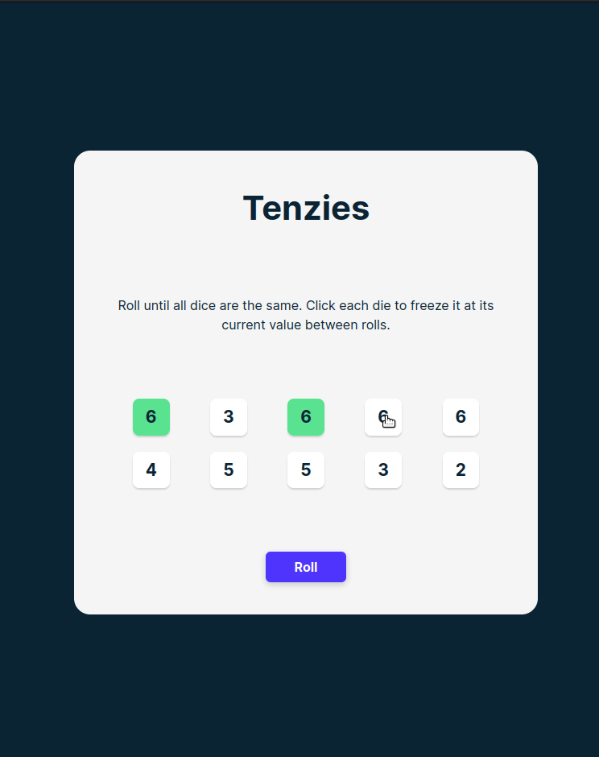

# Meme Generator
A small, web page, made as a React exercise. See it live [here](https://bofmar.github.io/tenzies). 

This was made as part of the [Learn React for free](https://scrimba.com/learn/learnreact) scrimba course.

Demonstrates the use of React components, props and state.

Recreation of the classic kid's game Tenzies where the players roll 10 dice and try to get all of the to be on the same side. Players can hold any number of dice and then re-roll the rest.

Uses [nanoid](https://www.npmjs.com/package/nanoid) to generate the ids for each die, [react-confetti](https://www.npmjs.com/package/react-confetti) for the confetti effect and [window-size](https://www.npmjs.com/package/@react-hook/window-size) for dynamically passing the window's current width and height to the confetti element.

## Demo

